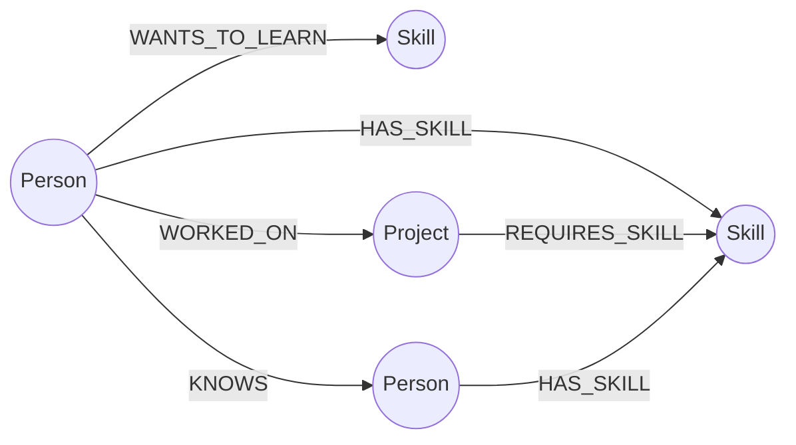

# MentorMesh

A skill and mentorship network for an organization, backed by **CognoDB** (a managed, Neo4j-compatible graph database).

MentorMesh answers questions like:

- *"Who could mentor me in GraphQL, that I don't already know, but who's worked on a project with me?"*
- *"Which required skill on this project does nobody have at expert level — and who elsewhere in the company does?"*
- *"What's the shortest chain of connections between me and that person in another team?"*

---

## Why a graph database?

An org's skills, projects, and relationships form a genuinely dense, irregular network — some people share five projects, others share none; skill overlap is uneven; connection chains vary in length person to person. Modeling this in a relational schema means a `people` table, a `skills` table, a `projects` table, and three or four join tables (`person_skills`, `person_projects`, `project_skills`, `person_connections`) — and every interesting question requires chaining several joins together.

The mentor-finder query is the clearest example. In SQL, "find someone who shares a project with me, has expert skill in something I want to learn, and isn't already in my network" needs:

- a self-join through the project-membership join table (to find shared-project colleagues),
- another join through the skill join table (to check their skill level),
- a `NOT EXISTS` anti-join against the connections table (to exclude people I already know),
- and a filter on `openToMentor`.

That's four joins and an anti-join to express one idea. In Cypher, it's a single readable pattern match (see [Mentor Finder](#1-mentor-finder-the-core-query) below) — because the relationships *are* the schema, not a side effect of foreign keys.

The same is true for the shortest-path query: finding the shortest chain of connections between two people, of unknown length, through a mix of relationship types, is a recursive query in SQL (via recursive CTEs, with real performance concerns as the graph grows) and a single built-in function (`shortestPath()`) in Cypher.

---

## Data model



**Nodes**

| Label | Key properties |
|---|---|
| `Person` | `name`, `title`, `bio`, `openToMentor` |
| `Skill` | `name`, `category` |
| `Project` | `name`, `description`, `startDate` |

**Relationships**

| Type | Direction | Properties |
|---|---|---|
| `HAS_SKILL` | `(Person)->(Skill)` | `level` (beginner/intermediate/expert), `years` |
| `WANTS_TO_LEARN` | `(Person)->(Skill)` | `priority` |
| `WORKED_ON` | `(Person)->(Project)` | `role` |
| `REQUIRES_SKILL` | `(Project)->(Skill)` | — |
| `KNOWS` | `(Person)->(Person)` | — (existing direct connections, seeded bidirectionally) |

---

## Setup

### 1. Create your CognoDB instance

1. Sign up at [console.cognodb.com/signup](https://console.cognodb.com/signup) (no credit card required for the free tier).
2. Create a free (`c0`) instance and pick a region — it provisions in under a minute.
3. Copy the connection URI (`bolt+s://<instance-id>.databases.cognodb.cloud`) and the generated password for user `cognodb`. **The password is shown once** — save it immediately.

### 2. Configure the app

```bash
cp .env.example .env.local
```

Edit `.env.local`:

```
COGNODB_URI=bolt+s://<instance-id>.databases.cognodb.cloud
COGNODB_USER=cognodb
COGNODB_PASSWORD=<your password>
```

`.env.local` is gitignored — connection details are never committed.

### 3. Install dependencies and seed the database

```bash
npm install
node scripts/seed.js
```

This loads 15 people, 18 skills, 5 projects, and the relationships between them (skills, project membership, existing connections, and required skills per project) — enough realistic data to demonstrate every query meaningfully.

Run `node scripts/seed.js --reset` to wipe and reseed from scratch.

### 4. Run the app

```bash
npm run dev
```

Visit `http://localhost:3000`.

### 5. Deploying

When deploying to Vercel or another hosting provider, add these server-side environment variables in the provider's project settings:

```
COGNODB_URI=bolt+s://<instance-id>.databases.cognodb.com
COGNODB_USER=cognodb
COGNODB_PASSWORD=<your password>
```

Add them for the `Production` environment, then redeploy. Do not prefix them with `NEXT_PUBLIC_`: the database credentials must remain server-only. `.env.local` is for local development and is not committed to Git.

Seed CognoDB from a machine where the credentials are configured before using the deployed app:

```bash
node scripts/seed.js
```

---

## The queries

All Cypher lives in [`lib/queries.js`](./lib/queries.js), parameterized throughout — no string-concatenated Cypher anywhere in the app.

### 1. Mentor Finder (the core query)

```cypher
MATCH (me:Person {name: $personName})-[:WORKED_ON]->(proj:Project)<-[:WORKED_ON]-(candidate:Person)
WHERE candidate <> me
  AND candidate.openToMentor = true
  AND NOT (me)-[:KNOWS]->(candidate)
MATCH (me)-[:WANTS_TO_LEARN]->(skill:Skill)<-[hs:HAS_SKILL {level: "expert"}]-(candidate)
RETURN DISTINCT candidate, collect(DISTINCT proj) AS sharedProjects, collect(DISTINCT skill) AS matchingSkills
```

A 2-hop traversal (`me → project → candidate`) combined with a skill match and an anti-join, expressed as one pattern. This is the query a relational schema would find genuinely awkward — see [Why a graph database?](#why-a-graph-database) above.

### 2. Skill Gap Analysis

```cypher
MATCH (proj:Project {name: $projectName})-[:REQUIRES_SKILL]->(skill:Skill)
WHERE NOT EXISTS {
  MATCH (proj)<-[:WORKED_ON]-(member:Person)-[hs:HAS_SKILL]->(skill)
  WHERE hs.level = "expert"
}
RETURN skill
```

Finds required skills with no expert-level owner on the project team, then (in a second query) looks org-wide for people who do have that skill at expert level.

### 3. Path Finder (shortest path)

```cypher
MATCH (a:Person {name: $from}), (b:Person {name: $to}),
      path = shortestPath((a)-[:KNOWS|WORKED_ON|HAS_SKILL*..6]-(b))
RETURN nodes(path), relationships(path)
```

Variable-length pathfinding across three relationship types at once, using Cypher's built-in `shortestPath()`. The equivalent in SQL would require a recursive CTE with real performance concerns as the graph grows.

---

## Application structure

```
app/
  page.js                    # Directory + hero network visualization
  people/[name]/page.js      # Person profile + mentor suggestions
  mentor-finder/page.js      # Standalone mentor finder (query 1)
  skill-gap/page.js          # Skill gap analysis (query 2)
  path-finder/page.js        # Shortest path finder (query 3)
  api/                       # API routes — one per query, all parameterized
lib/
  neo4j.js                   # Driver singleton + typed error handling
  queries.js                 # All Cypher, isolated and documented
components/
  NetworkPreview.js          # Signature hero visualization (real data, not decorative)
  States.js                  # Loading / empty / error UI states
  Badge.js, NavBar.js
scripts/
  seed.js                    # Seed script — realistic sample data
```

## Error handling

Every API route distinguishes between two failure modes and returns a typed error the UI can act on:

- **Configuration error** (`COGNODB_URI`/`COGNODB_PASSWORD` missing) — shown as a setup instruction.
- **Database unreachable** (instance paused, network issue, wrong credentials) — shown as a clear "can't reach the database" message with guidance to check the CognoDB console.

Every page also has a distinct **empty state** (e.g. "no mentor matches" explains *why*, not just that the list is empty) rather than a blank screen.

---

## Tech stack

- **Next.js** (App Router) — pages and API routes in one project
- **neo4j-driver** (official) — works against CognoDB since it speaks Bolt/openCypher
- **Tailwind CSS** — styling, with a custom design token set (see `app/globals.css`)
- **Fraunces / Inter / IBM Plex Mono** — display, body, and data/mono type roles

---

## Screenshots

_Add screenshots here after running the app locally against seeded data — e.g. the home page with the network preview, a Mentor Finder result, and a Skill Gap result._

---

## Deployment

Deploy to Vercel (or any Node host):

```bash
vercel
```

Set `COGNODB_URI`, `COGNODB_USER`, and `COGNODB_PASSWORD` as environment variables in your hosting provider's dashboard — never commit them.

> **Note:** Keep your CognoDB instance running after submission in case it needs to be tested against live data.
